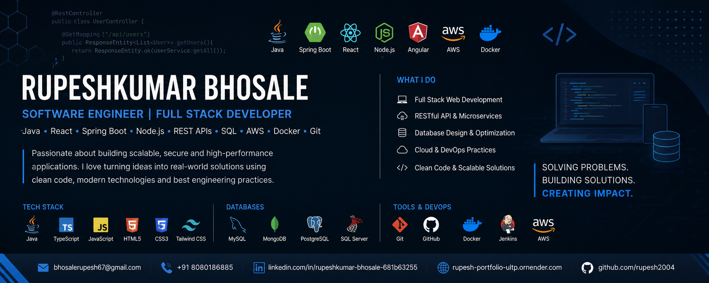

<!-- ========== HERO BANNER (FULL WIDTH) ========== -->

  

<!-- ========== MAIN HEADING ========== -->
<h1 align="center">Hi 👋, I'm Rupeshkumar Bhosale</h1>

<h3 align="center">
  Software Engineer • Full Stack Developer • Android Developer
</h3>

  Building scalable web applications, mobile apps, REST APIs, and cloud-ready solutions.

<!-- ========== BADGES ========== -->

  
  
  

---

## 🚀 About Me

I'm a passionate **Software Engineer** and **Full Stack Developer** from India who enjoys building modern, scalable applications for both web and mobile platforms.

I have experience developing enterprise applications, REST APIs, cloud-based systems, Android applications, and responsive web applications.

### 🔭 Current Focus

- 🌱 Full Stack Development  
- ☁️ Cloud & AWS  
- ⚡ Spring Boot Microservices  
- 📱 Android Development  
- ⚛ React & Next.js  
- 🚀 Scalable Backend Systems  

---

## 💻 Tech Stack

| **Languages** | **Frontend** | **Backend** | **Mobile** | **Database** | **Cloud & DevOps** |
|:---|:---|:---|:---|:---|:---|
| Java • JavaScript • TypeScript • Go • Python • Kotlin • Dart • C++ • SQL | React • Next.js • Vue.js • HTML5 • CSS3 • Tailwind • Bootstrap | Spring Boot • Node.js • Express.js • Go Gin • REST APIs • JWT | Android • Flutter • React Native | MongoDB • MySQL • PostgreSQL • Firebase • SQLite | AWS • Docker • Git • GitHub • Jenkins • Postman |

---

## 💼 Experience

### 💻 Software Development Intern  
**Maharashtra Knowledge Corporation Limited (MKCL)**

Worked on production-grade enterprise applications serving thousands of users.

- Developed REST APIs using Go & Gin  
- Built responsive interfaces using Vue.js  
- Designed MongoDB schemas  
- Implemented Authentication & Authorization  
- Integrated third-party APIs  
- Collaborated using Git  
- Optimized backend performance  
- Worked in Agile environment  

---

### 📱 Co-Lead Android Team  
**Google Developers Student Club**

- Led Android Team  
- Mentored students in Java, Kotlin and Flutter  
- Conducted Android workshops  
- Built production-ready Android applications  

---

## 🚀 Featured Projects

| Project | Description | Tech Stack |
|:---|:---|:---|
| **🩺 Meditrack** | Complete Healthcare Management Platform – Patient Management, Doctor Dashboard, Appointment Booking, Medicine Reminder, Medical Reports, Auth, Notifications, Mobile + Web | Next.js • React Native • Node.js • MongoDB • JWT |
| **📖 Note of Life** | Modern Digital Diary – Secure Journal, Google/GitHub Auth, Mood Tracking, Timeline, PDF Export, Dark Mode, Email Verification | Next.js • MongoDB • JWT • OAuth |
| **🛒 FlipDeals** | Full Stack E‑Commerce – User Auth, Shopping Cart, Orders, Admin Dashboard, Stripe Payment, Email Notifications | React • Node.js • Express • MongoDB |
| **⌨ Typing Tutor** | Multi‑language Typing Platform – English, Hindi, Marathi, Accuracy, WPM, Leaderboard | Vue.js • Go • Gin |
| **📱 Placement Cell App** | Campus Placement Management – Student/Company/Admin Portals, Notifications, Firebase | React Native • Firebase |
| **🐦 Bird Harvesting System** | AI‑based Poultry Monitoring – Bird Counting, Android App, Python Processing, Firebase | Android • Python • Firebase |

---

## 🏆 Achievements

- 🥇 Google Arcade Game Diamond League Winner  
- 🎁 GeeksforGeeks Problem of the Day Goodies  
- 📜 Meta Android Development Certificate  
- 📜 Meta Git Version Control  
- 📜 Full Stack Development Certificate  

---

## 📈 GitHub Statistics

  
  

  

---

## 🌐 Connect With Me

- 📧 **Email:** [bhosalerupesh67@gmail.com](mailto:bhosalerupesh67@gmail.com)  
- 💼 **LinkedIn:** [rupeshkumar-bhosale](https://linkedin.com/in/rupeshkumar-bhosale-681b63255)  
- 💻 **GitHub:** [rupesh2004](https://github.com/rupesh2004)  
- 🌍 **Portfolio:** [rupesh-portfolio](https://rupesh-portfolio-ultp.onrender.com)  

---

## ❤️ Thanks for visiting!

If you like my work, consider giving a ⭐ to my repositories.

**Happy Coding 🚀**
